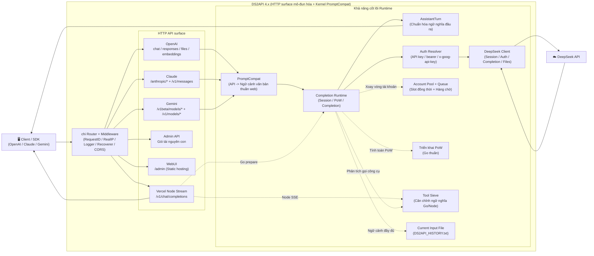

<p align="center">
  
</p>

# DS2API

## Ghi chú: Dự án này được phát triển tiếp nối từ phiên bản gốc ([CJackHwang/ds2api](https://github.com/CJackHwang/ds2api)). Kho lưu trữ gốc hiện đã được lưu trữ (archived).

### Trên cơ sở giữ lại các tính năng cốt lõi, dự án đã thực hiện một số sửa đổi, chủ yếu giải quyết vấn đề khóa tài khoản DeepSeek. Hiệu quả rõ rệt (?) Thử nghiệm thực tế hiện tại cá nhân sử dụng hầu như không còn nguy cơ bị cấm ngôn hay khóa tài khoản.

<a href="https://trendshift.io/repositories/24508" target="_blank"></a>

[](LICENSE)


[](docs/DEPLOY.md)

[](https://zeabur.com/templates/L4CFHP)
[](https://vercel.com/new/clone?repository-url=https://github.com/ouqiting/ds2api)

Chuyển đổi khả năng trò chuyện Web của DeepSeek thành API tương thích với OpenAI, Claude và Gemini. Backend cốt lõi được triển khai bằng **Go**, cầu nối phát luồng Vercel sử dụng thêm một lượng nhỏ Node Runtime, giao diện người dùng là bảng quản trị React WebUI (mã nguồn tại `webui/`, tự động đóng gói vào `static/admin` khi triển khai).

Ngôn ngữ tài liệu: [Tiếng Việt](README.vi.md) | [中文](README.MD)

Lối vào tài liệu: [Điều hướng tài liệu](docs/README.md) / [Giải thích kiến trúc](docs/ARCHITECTURE.md) / [Tài liệu API](API.md)

【Cảm ơn cộng đồng Linux.do và các nhà phát triển trên GitHub đã hỗ trợ và đóng góp cho dự án】

> **TUYÊN BỐ MIỄN TRỪ TRÁCH NHIỆM QUAN TRỌNG**
> 
> Kho lưu trữ này chỉ phục vụ mục đích học tập, nghiên cứu, thử nghiệm cá nhân và xác minh nội bộ, không cung cấp bất kỳ hình thức cấp phép thương mại, đảm bảo khả năng áp dụng hay đảm bảo kết quả nào.
> 
> Tác giả và những người bảo trì kho lưu trữ không chịu trách nhiệm cho bất kỳ tổn thất trực tiếp hay gián tiếp, khóa tài khoản, mất mát dữ liệu, rủi ro pháp lý hoặc khiếu nại của bên thứ ba phát sinh từ việc sử dụng, sửa đổi, phân phối, triển khai hoặc dựa vào dự án này.
> 
> Vui lòng không sử dụng dự án này trong các kịch bản vi phạm điều khoản dịch vụ, thỏa thuận, quy định pháp luật hoặc quy tắc nền tảng. Trước khi sử dụng thương mại, vui lòng tự xác nhận `LICENSE`, các thỏa thuận liên quan và liệu bạn đã nhận được sự đồng ý bằng văn bản của tác giả hay chưa.

## Mục lục

- [Tổng quan kiến trúc (Tóm tắt)](#tổng-quan-kiến-trúc-tóm-tắt)
- [Khả năng cốt lõi](#khả-năng-cốt-lõi)
- [Ma trận tương thích nền tảng](#ma-trận-tương-thích-nền-tảng)
- [Hỗ trợ mô hình](#hỗ-trợ-mô-hình)
  - [Giao diện OpenAI](#giao-diện-openai-get-v1models)
  - [Giao diện Claude](#giao-diện-claude-get-anthropicv1models)
  - [Giao diện Gemini](#giao-diện-gemini)
- [Bắt đầu nhanh](#bắt-đầu-nhanh)
  - [Cách 1: Tải bản đóng gói Release](#cách-1-tải-bản-đóng-gói-release)
  - [Cách 2: Chạy bằng Docker](#cách-2-chạy-bằng-docker)
  - [Cách 3: Triển khai trên Vercel](#cách-3-triển-khai-trên-vercel)
  - [Cách 4: Chạy nguồn cục bộ](#cách-4-chạy-nguồn-cục-bộ)
- [Giải thích cấu hình](#giải-thích-cấu-hình)
- [Chế độ xác thực](#chế-độ-xác-thực)
- [Mô hình đồng thời](#mô-hình-đồng-thời)
- [Thích ứng Tool Call](#thích-ứng-tool-call)
- [Công cụ bắt gói tin phát triển cục bộ](#công-cụ-bắt-gói-tin-phát-triển-cục-bộ)
- [Mục lục tài liệu](#mục-lục-tài-liệu)
- [Kiểm thử](#kiểm-thử)
- [Tự động đóng gói Release (GitHub Actions)](#tự-động-đóng-gói-release-github-actions)
- [Tuyên bố miễn trừ trách nhiệm](#tuyên-bố-miễn-trừ-trách-nhiệm)

## Tổng quan kiến trúc (Tóm tắt)



Xem chi tiết kiến trúc và trách nhiệm từng thư mục tại [docs/ARCHITECTURE.md](docs/ARCHITECTURE.md).

- **Backend**: Go (`cmd/ds2api/`, `api/`, `internal/`), không phụ thuộc vào Python runtime.
- **Frontend**: Bảng quản trị React (`webui/`), môi trường chạy tự động lưu trữ sản phẩm tĩnh đã build.
- **Triển khai**: Chạy cục bộ, Docker, Vercel Serverless, Linux systemd.

## Khả năng cốt lõi

| Khả năng | Mô tả |
| --- | --- |
| Tương thích OpenAI | `GET /v1/models`, `GET /v1/models/{id}`, `POST /v1/chat/completions`, `POST /v1/responses`, `GET /v1/responses/{response_id}`, `POST /v1/embeddings`, `POST /v1/files`, `GET /v1/files/{file_id}` |
| Tương thích Claude | `GET /anthropic/v1/models`, `POST /anthropic/v1/messages`, `POST /anthropic/v1/messages/count_tokens` (và đường dẫn tắt `/v1/messages`, `/messages`) |
| Tương thích Gemini | `POST /v1beta/models/{model}:generateContent`, `POST /v1beta/models/{model}:streamGenerateContent` (và đường dẫn `/v1/models/{model}:*`) |
| Tương thích Ollama | `GET /api/version`, `GET /api/tags`, `POST /api/show` |
| Chính sách CORS thống nhất | `/v1/*`, `/anthropic/*`, `/v1beta/models/*`, `/api/*`, `/admin/*` thống nhất chung chiến lược CORS; trên Vercel Node Runtime `/v1/chat/completions` cũng căn chỉnh cùng quy tắc放行, giảm thiểu hạn chế preflight header từ bên thứ ba |
| Xoay vòng đa tài khoản | Tự động làm mới token, hỗ trợ đăng nhập bằng Email hoặc Số điện thoại |
| Kiểm soát hàng chờ đồng thời | Giới hạn in-flight trên mỗi tài khoản + hàng chờ, tính toán động giá trị đồng thời đề xuất |
| DeepSeek PoW | Triển khai Go thuần hiệu năng cao (DeepSeekHashV1), phản hồi trong vài miligiây |
| Tool Calling | Xử lý chống rò rỉ: Nhận diện đặc trưng độ tin cậy cao ngoài khối code, phát `delta.tool_calls` sớm, đầu ra tăng cường cấu trúc |
| Admin API | Quản lý cấu hình, cập nhật hot cài đặt runtime, quản lý proxy, kiểm tra tài khoản / thử nghiệm hàng loạt, dọn dẹp phiên, nhập xuất, đồng bộ Vercel, kiểm tra phiên bản |
| Bảng quản trị WebUI | Trực quan hóa tại `/admin` (Hỗ trợ song ngữ Trung/Anh, chế độ tối, xem lịch sử phản hồi phía máy chủ) |
| Đầu dò vận hành | `GET /healthz` (Liveness), `GET /readyz` (Readiness) |

OpenAI `/v1/*` vẫn là đường dẫn chuẩn được khuyến nghị; đồng thời hỗ trợ các đường dẫn tắt gốc như `/models`, `/chat/completions`, `/responses`, `/embeddings`, `/files`, `/files/{file_id}`, thuận tiện cho client bên thứ ba chỉ cấu hình địa chỉ gốc DS2API.

## Ma trận tương thích nền tảng

| Cấp độ | Nền tảng | Trạng thái hiện tại |
| --- | --- | --- |
| P0 | Codex CLI/SDK (`wire_api=chat` / `wire_api=responses`) | ✅ |
| P0 | OpenAI SDK (JS/Python, chat + responses) | ✅ |
| P0 | Vercel AI SDK (tương thích openai) | ✅ |
| P0 | Anthropic SDK (messages) | ✅ |
| P0 | Google Gemini SDK (generateContent) | ✅ |
| P1 | LangChain / LlamaIndex / OpenWebUI (Tích hợp tương thích OpenAI) | ✅ |

## Hỗ trợ mô hình

### Giao diện OpenAI (`GET /v1/models`)

| Loại mô hình | ID Mô hình | thinking | search |
| --- | --- | --- | --- |
| default | `deepseek-v4-flash` | Bật mặc định, có thể điều khiển qua tham số yêu cầu | ❌ |
| default | `deepseek-v4-flash-nothinking` | Tắt vĩnh viễn, không bị ảnh hưởng bởi tham số yêu cầu | ❌ |
| expert | `deepseek-v4-pro` | Bật mặc định, có thể điều khiển qua tham số yêu cầu | ❌ |
| expert | `deepseek-v4-pro-nothinking` | Tắt vĩnh viễn, không bị ảnh hưởng bởi tham số yêu cầu | ❌ |
| default | `deepseek-v4-flash-search` | Bật mặc định, có thể điều khiển qua tham số yêu cầu | ✅ |
| default | `deepseek-v4-flash-search-nothinking` | Tắt vĩnh viễn, không bị ảnh hưởng bởi tham số yêu cầu | ✅ |
| vision | `deepseek-v4-vision` | Bật mặc định, có thể điều khiển qua tham số yêu cầu | ❌ |
| vision | `deepseek-v4-vision-nothinking` | Tắt vĩnh viễn, không bị ảnh hưởng bởi tham số yêu cầu | ❌ |

Ngoài mô hình gốc, ứng dụng cũng hỗ trợ các bí danh (alias) phổ biến (như `gpt-4.1`, `gpt-5`, `gpt-5-codex`, `o3`, `claude-*`, `gemini-*`), nhưng `/v1/models` sẽ trả về ID mô hình gốc DeepSeek đã được chuẩn hóa. Nếu tên alias tự nối thêm hậu tố `-nothinking`, nó cũng sẽ ánh xạ tới mô hình tương ứng bị buộc tắt suy luận. Chi tiết hành vi alias xem tại [API.md](API.md#chiến-lược-phân-tích-alias-mô-hình) và `config.example.json`.
Hiện tại mô hình thị giác phía upstream chỉ mở kênh `vision`, không cung cấp biến thể thị giác tìm kiếm web độc lập.

### Giao diện Claude (`GET /anthropic/v1/models`)

| Mô hình hay dùng | Ánh xạ mặc định |
| --- | --- |
| `claude-sonnet-4-6` | `deepseek-v4-flash` |
| `claude-sonnet-4-6-nothinking` | `deepseek-v4-flash-nothinking` |
| `claude-haiku-4-5` (tương thích `claude-3-5-haiku-latest`) | `deepseek-v4-flash` |
| `claude-haiku-4-5-nothinking` | `deepseek-v4-flash-nothinking` |
| `claude-opus-4-6` | `deepseek-v4-pro` |
| `claude-opus-4-6-nothinking` | `deepseek-v4-pro-nothinking` |

Có thể đè mối ánh xạ thông qua `model_aliases` trong cấu hình; nếu tên mô hình yêu cầu chứa `-nothinking`, ngữ nghĩa tắt suy luận sẽ được tự động thêm vào kết quả cuối cùng.
`/anthropic/v1/models` ngoài các bí danh chính trên cũng sẽ trả về Claude 4.x snapshots, ID lịch sử 3.x và các alias phổ biến, giúp các client cũ tương thích trực tiếp.

#### Hướng dẫn kết nối Claude Code (Thử nghiệm thực tế)

- Khuyên dùng `ANTHROPIC_BASE_URL` trỏ trực tiếp tới địa chỉ gốc DS2API (ví dụ `http://127.0.0.1:5001`), Claude Code sẽ gửi yêu cầu tới `/v1/messages?beta=true`.
- `ANTHROPIC_API_KEY` cần khớp với `keys` trong `config.json`; nên giữ cả key thông thường và key dạng `sk-ant-*` để tương thích thói quen kiểm tra của các client khác nhau.
- Nếu hệ thống có thiết lập proxy, nên cấu hình `NO_PROXY=127.0.0.1,localhost,<IP máy bạn>` cho địa chỉ DS2API để tránh các yêu cầu loopback bị proxy chặn.
- Nếu gặp sự cố "kết quả gọi công cụ xuất thành văn bản, không thực thi", hãy ưu tiên kiểm tra xem đầu ra mô hình có phải là khối công cụ EPSE dấu ống bán góc được khuyến nghị không: `<|EPSE|tool_calls><|EPSE|invoke name="..."><|EPSE|parameter name="...">...`. Lớp tương thích cũng chấp nhận XML chuẩn kiểu cũ: `<tool_calls><invoke name="..."><parameter name="...">...`; các dạng kiểu cũ `<tools>` / `<tool_call>` / `<tool_name>` / `<param>`, `<function_call>`, `tool_use` hoặc đoạn JSON `tool_calls` thuần sẽ không thực thi mà được xử lý như văn bản thông thường.

### Giao diện Gemini

Bộ thích ứng Gemini định tuyến request tới **upstream Google Gemini Web** (cần cấu hình tài khoản Cookie với `provider: "gemini"` trong `accounts`). Tên mô hình chuẩn là `gemini-pro`, `gemini-flash`, `gemini-flash-lite` — ba tên này được suy ra từ *category* của mô hình do chính tài khoản upstream báo về, ổn định và khớp với `gemini-webapi`; các tên kèm phiên bản (như `gemini-3-flash`, `gemini-2.5-pro`) và tên theo hạng (như `gemini-pro-advanced`) đều là alias tương thích, tất cả phân giải về một trong ba mô hình chuẩn. Model id và hạng tài khoản (Basic / Plus / Advanced) được phát hiện động từ upstream lúc khởi tạo phiên — phía client không cần và không thể chỉ định. Hỗ trợ cả 2 cách gọi `generateContent` và `streamGenerateContent`, hỗ trợ đầy đủ Tool Calling (đầu ra `functionDeclarations` → `functionCall`). Nếu tên mô hình có hậu tố `-nothinking`, ví dụ `gemini-pro-nothinking`, suy luận sẽ bị buộc tắt.

Khi chưa cấu hình tài khoản Gemini nào, request `gemini-*` mặc định trả về `400`; nếu bật `model_fallback_to_deepseek: true` trong `config.json`, request sẽ quay về hành vi ánh xạ sang DeepSeek như trước.

## Bắt đầu nhanh

### Khuyên dùng thứ tự ưu tiên phương thức triển khai

Nên chọn phương thức triển khai theo thứ tự sau:

1. **Tải bản đóng gói Release để chạy**: Tiện lợi nhất, sản phẩm đã biên dịch sẵn, phù hợp với đại đa số người dùng.
2. **Triển khai bằng Docker / GHCR Image**: Phù hợp với môi trường cần container hóa, điều phối hoặc triển khai đám mây.
3. **Triển khai Vercel**: Phù hợp với trường hợp đã có sẵn môi trường Vercel và chấp nhận các ràng buộc nền tảng của nó.
4. **Chạy nguồn cục bộ / Tự biên dịch**: Phù hợp cho phát triển, gỡ lỗi hoặc cần tự sửa đổi mã nguồn.

### Bước 1 chung (Tất cả phương thức triển khai)

Dùng `config.json` làm nguồn cấu hình duy nhất (Khuyên dùng):

```bash
cp config.example.json config.json
# Chỉnh sửa config.json
```

Khuyến nghị triển khai tiếp theo:

- Chạy cục bộ: Đọc trực tiếp `config.json`
- Docker / Vercel: Tạo `DS2API_CONFIG_JSON` (Base64) từ `config.json` để chèn vào biến môi trường, hoặc ghi trực tiếp JSON thô

"Mẫu cấu hình đầy đủ" trong bảng quản trị WebUI cũng sử dụng lại cùng một tập tin `config.example.json`, do đó sau khi cập nhật tập tin mẫu, giao diện frontend sẽ tự động giữ tính thống nhất.

### Cách 1: Tải bản đóng gói Release

Mỗi khi phát hành Release, GitHub Actions sẽ tự động biên dịch gói nhị phân đa nền tảng:

```bash
# Sau khi tải gói nén tương ứng với nền tảng
tar -xzf ds2api_<tag>_linux_amd64.tar.gz
cd ds2api_<tag>_linux_amd64
cp config.example.json config.json
# Chỉnh sửa config.json
./ds2api
```

### Cách 2: Chạy bằng Docker

Tải `docker-compose.tar.gz` từ Release mới nhất (chứa 4 tệp `docker-compose.yml`, `config.example.json`, `.env.example`, `README.MD`):

```bash
# 1. Tải và giải nén
mkdir ds2api && cd ds2api
wget https://github.com/ouqiting/ds2api/releases/latest/download/docker-compose.tar.gz
tar -xzf docker-compose.tar.gz

# 2. Chuẩn bị biến môi trường và tập tin cấu hình
cp .env.example .env
cp config.example.json config.json

# 3. Chỉnh sửa .env (Tối thiểu đặt DS2API_ADMIN_KEY; nếu cần sửa cổng máy chủ host, có thể đặt thêm DS2API_HOST_PORT)
nano .env
#    DS2API_ADMIN_KEY=Vui lòng thay bằng mật khẩu mạnh

# 4. Khởi động
docker compose up -d

# 5. Xem nhật ký (logs)
docker compose logs -f
```

Mặc định `docker-compose.yml` sẽ ánh xạ cổng `6011` của máy chủ host vào cổng `5001` trong container. Nếu bạn muốn mở trực tiếp cổng `5001` ra ngoài, vui lòng đặt `DS2API_HOST_PORT=5001` (hoặc tự điều chỉnh cấu hình `ports`).
Đồng thời mặc định mount `./config.json` vào container tại `/data/config.json`, và đặt `DS2API_CONFIG_PATH=/data/config.json`, nhằm tránh tình trạng `/app` chỉ đọc dẫn đến lưu thất bại token runtime.
Image sẽ tạo sẵn thư mục `/data` và cấp quyền cho user không phải root `ds2api`; nếu sử dụng bind mount tệp đơn, hãy đảm bảo tệp `config.json` trên máy host có quyền đọc ghi đối với user container, ví dụ `chmod 644 config.json`.

Cập nhật Image: `docker compose pull`

#### Triển khai 1-Click trên Zeabur (Dockerfile)

1. Nhấp nút “Deploy on Zeabur” ở trên để triển khai nhanh 1-click.
2. Sau khi triển khai xong, truy cập `/admin`, sử dụng `DS2API_ADMIN_KEY` trong hướng dẫn biến môi trường/mẫu của Zeabur để đăng nhập.
3. Trong bảng quản trị, nhập/chỉnh sửa cấu hình (sẽ ghi và lưu cố định vào `/data/config.json`).

Lần đầu Zeabur khởi động với volume rỗng có thể chưa có `/data/config.json`; DS2API sẽ dùng cấu hình chế độ tệp rỗng để khởi động trước, và tạo tệp đó khi lưu lần đầu trong bảng quản trị.
Nếu tự triển khai thủ công không dùng mẫu, chọn dịch vụ kho lưu trữ GitHub trong Zeabur, Root Directory giữ `/`, sử dụng `Dockerfile` gốc kho lưu trữ để build; thêm volume lưu trữ `/data`, đặt `PORT=5001`, `DS2API_ADMIN_KEY=Khóa_mạnh_của_bạn`, `DS2API_CONFIG_PATH=/data/config.json`, sau đó mở cổng HTTP `5001`. Xem các bước chi tiết tại [docs/DEPLOY.md](docs/DEPLOY.md#không-dùng-mẫu-triển-khai-thủ-công).

Ghi chú: Khi Zeabur sử dụng `Dockerfile` trong kho lưu trữ để build trực tiếp, không cần truyền thêm `BUILD_VERSION`; image sẽ ưu tiên đọc tham số build đó, nếu không có sẽ tự động lùi về tệp `VERSION` ở gốc kho lưu trữ.

### Cách 3: Triển khai trên Vercel

1. Fork kho lưu trữ về GitHub của bạn
2. Import dự án trên Vercel
3. Cấu hình biến môi trường (Tối thiểu đặt `DS2API_ADMIN_KEY`; khuyến nghị đặt thêm `DS2API_CONFIG_JSON`)
4. Triển khai

Khuyên dùng: Sao chép mẫu và điền thông tin trước tại thư mục kho lưu trữ:

```bash
cp config.example.json config.json
# Chỉnh sửa config.json
```
> Gợi ý: Khi tạo dự án, Application Preset giữ mặc định là `Other`.

Khuyến nghị: Chuyển `config.json` thành Base64 ở cục bộ trước, sau đó dán vào `DS2API_CONFIG_JSON` để tránh lỗi định dạng JSON:

```bash
base64 < config.json | tr -d '\n'
```

> **Ghi chú về Streaming**: OpenAI Chat streaming trên Vercel sẽ do `api/chat-stream.js` (Node Runtime) tiếp nhận, nhưng `vercel.json` chỉ rewrite đường dẫn chuẩn `/v1/chat/completions` tới Node; đường dẫn tắt gốc `/chat/completions` vẫn đi theo chuỗi chính của Go. Việc xác thực, chọn tài khoản, chuẩn bị phiên/PoW vẫn do interface prepare nội bộ của Go thực hiện; phản hồi phát luồng (bao gồm `tools`) phía Node thực hiện lắp ráp đầu ra và xử lý chống rò rỉ căn chỉnh với Go. Khi cần phát luồng thời gian thực trên Vercel, vui lòng sử dụng `/v1/chat/completions`.

Hướng dẫn triển khai chi tiết xin tham khảo [Hướng dẫn triển khai](docs/DEPLOY.md).

### Cách 4: Chạy nguồn cục bộ

**Yêu cầu tiên quyết**: Go 1.26+, Node.js `20.19+` hoặc `22.12+` (chỉ khi cần build WebUI; CI / Docker build sử dụng Node 24); đồng thời đảm bảo có `npm`, khuyến nghị `npm 10+`

```bash
# 1. Clone kho lưu trữ
git clone https://github.com/ouqiting/ds2api.git
cd ds2api

# 2. Cấu hình
cp config.example.json config.json
# Chỉnh sửa config.json, điền thông tin tài khoản DeepSeek và API key của bạn

# 3. Khởi chạy
go run ./cmd/ds2api
```

Địa chỉ truy cập cục bộ mặc định: `http://127.0.0.1:5001`

Dịch vụ thực tế bind tại: `0.0.0.0:5001`, do đó các thiết bị trong cùng mạng LAN thường cũng có thể truy cập qua IP nội bộ của bạn.

> **Tự động build WebUI**: Khi khởi chạy cục bộ lần đầu, nếu thư mục tĩnh WebUI chưa tồn tại, ứng dụng sẽ tự động thử chạy `npm ci --prefix webui` (chỉ khi thiếu phụ thuộc) và `npm run build --prefix webui -- --outDir static/admin --emptyOutDir` (yêu cầu máy có Node.js và npm; thư mục tĩnh có thể đè bằng `DS2API_STATIC_ADMIN_DIR`). Bạn cũng có thể build thủ công: `./scripts/build-webui.sh`

## Giải thích cấu hình

`README` chỉ giữ lại lối vào nhanh, các trường đầy đủ xin xem mẫu tại [config.example.json](config.example.json), và tham khảo [Hướng dẫn triển khai](docs/DEPLOY.md#0-yêu-cầu-tiên-quyết) cùng [Thực hành cấu hình API tốt nhất](API.md#thực-hành-cấu-hình-tốt-nhất).

Các trường thường dùng:

- `keys` / `api_keys`: Khóa truy cập của client, `api_keys` hỗ trợ thông tin meta `name` và `remark`, `keys` tiếp tục tương thích.
- `accounts`: Tài khoản DeepSeek quản lý, hỗ trợ đăng nhập `email` hoặc `mobile`, có thể cấu hình proxy, tên và ghi chú.
- `model_aliases`: Ánh xạ bí danh (alias) mô hình dùng chung cho OpenAI / Claude / Gemini.
- `runtime`: Chiến lược đồng thời tài khoản, hàng chờ và làm mới token, có thể cập nhật hot qua Admin Settings.
- `auto_delete.mode`: Chiến lược dọn dẹp phiên từ xa sau khi yêu cầu kết thúc, hỗ trợ `none` / `single` / `all`.
- `current_input_file`: Chiến lược tải lên ngữ cảnh tách biệt có hiệu lực toàn cục; mặc định tắt, khi bật và ngưỡng là `0`, khi kích hoạt sẽ gộp toàn bộ ngữ cảnh tải lên dưới dạng tệp ngữ cảnh `DS2API_HISTORY.txt`. Mô hình expert (pro) không hỗ trợ tải tệp, ngay cả khi bật tùy chọn này cũng sẽ không tạo `DS2API_HISTORY.txt`, các tham chiếu tệp do client truyền vào cũng sẽ bị bỏ qua.
- Nếu tắt `current_input_file`, yêu cầu sẽ chuyển tiếp trực tiếp, không tải lên tệp ngữ cảnh tách biệt.
- `thinking_injection`: Mặc định tắt; khi bật sẽ chèn thêm gợi ý tăng cường suy luận vào cuối tin nhắn user mới nhất, nâng cao độ ổn định suy luận cường độ cao và suy luận trước khi gọi công cụ; khi `prompt` để trống sẽ sử dụng gợi ý mặc định tích hợp sẵn.

Danh sách đầy đủ biến môi trường xem tại [Hướng dẫn triển khai](docs/DEPLOY.md), quy tắc xác thực API xem tại [API.md](API.md#quy-tắc-xác-thực).

## Chế độ xác thực

Khi gọi các giao diện nghiệp vụ (`/v1/*`, `/anthropic/*`, Gemini routes), ứng dụng hỗ trợ 2 chế độ:

| Chế độ | Mô tả |
| --- | --- |
| **Chế độ tài khoản quản lý** | `Bearer` hoặc `x-api-key` truyền key trong `config.keys`, dịch vụ sẽ tự động xoay vòng chọn tài khoản |
| **Chế độ token trực tiếp** | Khi token truyền vào không nằm trong `config.keys`, nó sẽ được dùng trực tiếp như một token DeepSeek |

Header yêu cầu tùy chọn `X-Ds2-Target-Account`: Chỉ định sử dụng một tài khoản quản lý cụ thể (giá trị là email hoặc mobile).
Nếu tài khoản chỉ định không tồn tại, hoặc hàng chờ tài khoản quản lý hiện tại đã đầy, yêu cầu sẽ trả về `429`; `429` hiện tại không kèm header `Retry-After`. Nếu tài khoản tồn tại nhưng đăng nhập/làm mới thất bại, sẽ trả về lỗi xác thực tương ứng.
Khi không chỉ định tài khoản đích, nếu completion trả về `429 upstream_empty_output` do đầu ra rỗng phía upstream thinking-only sau khi đã thử lại bù trên cùng tài khoản, chế độ tài khoản quản lý sẽ tự động chuyển sang tài khoản khả dụng tiếp theo, tạo session mới, và fresh retry một lần nữa với payload ban đầu.
 Gemini routes cũng có thể sử dụng `x-goog-api-key`, hoặc khi không có header xác thực có thể dùng `?key=` / `?api_key=` làm thông tin xác thực của bên gọi.

## Mô hình đồng thời

```
Số lượng đồng thời khả dụng mỗi tài khoản = DS2API_ACCOUNT_MAX_INFLIGHT (Mặc định 2)
Giá trị đồng thời đề xuất = Số lượng tài khoản × Giới hạn đồng thời mỗi tài khoản
Giới hạn hàng chờ = DS2API_ACCOUNT_MAX_QUEUE (Mặc định = Giá trị đồng thời đề xuất)
Ngưỡng 429 = in-flight + hàng chờ ≈ Số lượng tài khoản × 4
```

- Khi slot in-flight đầy, yêu cầu vào hàng chờ, **không bị 429 ngay lập tức**
- Chỉ khi vượt quá tổng khả năng chịu tải mới trả về `429 Too Many Requests`, phản hồi hiện tại không đi kèm `Retry-After`
- Lỗi 429 dạng completion đầu ra rỗng sẽ ưu tiên thử lại bù trên cùng tài khoản; chế độ tài khoản quản lý cũng sẽ chuyển sang tài khoản khả dụng khác để fresh retry một lần nữa trước khi trả về 429 cuối cùng
- `GET /admin/queue/status` trả về trạng thái đồng thời thời gian thực

## Thích ứng Tool Call

Khi yêu cầu đi kèm `tools`, DS2API sẽ xử lý chống rò rỉ và dịch thuật cấu trúc:

1. Chỉ bật nhận diện toolcall dạng thực thi trong **ngữ cảnh không phải Markdown code** (các ví dụ trong fenced code block và inline code span mặc định không kích hoạt)
2. Lớp phân tích hiện xem vỏ EPSE dấu ống bán góc là cuộc gọi thực thi được khuyến nghị: `<|EPSE|tool_calls>` → `<|EPSE|invoke name="...">` → `<|EPSE|parameter name="...">`; tương thích với XML chuẩn kiểu cũ `<tool_calls>` → `<invoke name="...">` → `<parameter name="...">`, cùng một số biến thể tiền tố/dấu phân cách EPSE. EPSE chỉ là bí danh vỏ, bên trong vẫn dựa theo ngữ nghĩa phân tích XML; các dạng kiểu cũ `<tools>` / `<tool_call>` / `<tool_name>` / `<param>`, `<function_call>`, `tool_use` / antml biến thể và đoạn JSON `tool_calls` thuần sẽ được xử lý như văn bản thông thường, wrapper hoàn chỉnh nhưng malformed cũng sẽ được giải phóng dưới dạng văn bản thông thường
3. `responses` phát luồng sử dụng nghiêm ngặt các sự kiện vòng đời item chính thức (`response.output_item.*`, `response.content_part.*`, `response.function_call_arguments.*`)
4. `responses` hỗ trợ và thực thi `tool_choice` (`auto`/`none`/`required`/bắt buộc hàm); khi vi phạm `required` không phát luồng trả về `422`, phát luồng trả về `response.failed`
5. Client yêu cầu giao thức nào, sẽ trả về gọi công cụ theo đúng giao thức đó (cấu trúc gốc của OpenAI/Claude/Gemini); phía mô hình ưu tiên ràng buộc đầu ra XML chuẩn, sau đó do lớp tương thích dịch thuật

> Giải thích: Phiên bản hiện tại ở lớp parser ưu tiên "cố gắng phân tích thành công", tất cả các công cụ XML có định dạng hợp lệ đều sẽ được thông qua, không lọc theo allow-list tên công cụ.
> Lớp phân tích sẽ giữ lại chuỗi rỗng hiển thị hoặc tham số khoảng trắng thuần; Prompt sẽ yêu cầu mô hình không chủ động xuất tham số rỗng, việc từ chối thiếu tham số/lệnh rỗng sẽ do bên thực thi công cụ hoặc kiểm tra schema phía client đảm nhận.
> 
> Nếu muốn đánh giá phương án "đóng gói gọi công cụ thành XML rồi đưa vào mô hình", có thể tham khảo: `docs/toolcall-semantics.md`.

## Công cụ bắt gói tin phát triển cục bộ

Dùng để định vị các vấn đề như "luồng suy luận / gọi công cụ trong responses". Khi bật sẽ tự động ghi lại N nhật ký body yêu cầu và phản hồi upstream DeepSeek gần nhất (mặc định 20 bản ghi, vượt quá tự động loại bỏ; một body phản hồi mặc định ghi tối đa 5 MB).

Ví dụ kích hoạt:

```bash
DS2API_DEV_PACKET_CAPTURE=true \
DS2API_DEV_PACKET_CAPTURE_LIMIT=20 \
go run ./cmd/ds2api
```

Truy vấn / Xóa sạch (Cần Admin JWT):

- `GET /admin/dev/captures`: Xem danh sách bắt gói tin (Mới nhất ở trên)
- `DELETE /admin/dev/captures`: Xóa sạch gói tin đã bắt
- `GET /admin/dev/raw-samples/query?q=Từ_khóa&limit=20`: Truy vấn bắt gói tin trong bộ nhớ theo từ khóa, và gộp chuỗi `completion + continue` theo `chat_session_id`
- `POST /admin/dev/raw-samples/save`: Lưu một chuỗi gói tin trúng tuyển thành mẫu phát lại `tests/raw_stream_samples/<sample-id>/`

Các trường trả về bao gồm:

- `request_body`: Body yêu cầu đầy đủ gửi tới DeepSeek
- `response_body`: Văn bản ghép nối nội dung phát luồng gốc do upstream trả về
- `response_truncated`: Có bị cắt ngắn do vượt kích thước đơn lẻ hay không

API lưu hỗ trợ sử dụng `query`, `chain_key` hoặc `capture_id` để chọn mục tiêu. Ví dụ:

```json
{"query":"Thời tiết Hà Nội","sample_id":"hn-weather-from-memory"}
```

## Mục lục tài liệu

| Tài liệu | Mô tả |
| --- | --- |
| [USER_GUIDE.vi.md](docs/USER_GUIDE.vi.md) | Hướng dẫn sử dụng phần mềm chi tiết (Tiếng Việt) |
| [README.vi.md](README.vi.md) / [README.MD](README.MD) | Tài liệu README chính của dự án (Tiếng Việt / 中文) |
| [API.md](API.md) / [API.en.md](API.en.md) | Tài liệu giao diện API (bao gồm ví dụ yêu cầu/phản hồi) |
| [DEPLOY.md](docs/DEPLOY.md) / [DEPLOY.en.md](docs/DEPLOY.en.md) | Hướng dẫn triển khai (Cục bộ/Docker/Vercel/systemd) |
| [CONTRIBUTING.md](docs/CONTRIBUTING.md) / [CONTRIBUTING.en.md](docs/CONTRIBUTING.en.md) | Hướng dẫn đóng góp |
| [TESTING.md](docs/TESTING.md) | Hướng dẫn sử dụng bộ kiểm thử |

## Kiểm thử

Hướng dẫn kiểm thử chi tiết xin tham khảo [docs/TESTING.md](docs/TESTING.md).

### Lệnh kiểm thử nhanh

```bash
# PR Gate cục bộ
./scripts/lint.sh
./tests/scripts/check-refactor-line-gate.sh
./tests/scripts/run-unit-all.sh
npm run build --prefix webui

# Kiểm thử end-to-end toàn chuỗi (Tài khoản thật, tạo nhật ký yêu cầu/phản hồi đầy đủ)
./tests/scripts/run-live.sh
```

## Tự động đóng gói Release (GitHub Actions)

Tệp workflow: `.github/workflows/release-artifacts.yml`

- **Điều kiện kích hoạt**: Mặc định chỉ tự động kích hoạt khi GitHub Release `published`; cũng hỗ trợ `workflow_dispatch` thủ công tại trang Actions và điền `release_tag` để chạy lại/phát hành bổ sung
- **Sản phẩm build**: Gói nhị phân đa nền tảng (`linux/amd64`, `linux/arm64`, `darwin/amd64`, `windows/amd64`), gói xuất Linux Docker Image + `sha256sums.txt`
- **Phát hành Container Image**: Chỉ đẩy lên GHCR (`ghcr.io/ouqiting/ds2api`)
- **Mỗi gói nén nhị phân bao gồm**: Tệp thực thi `ds2api`, `static/admin`, `config.example.json`, `.env.example`, `README.MD`, `README.en.md`, `LICENSE`

## Tuyên bố miễn trừ trách nhiệm

Dự án này được triển khai dựa trên phương thức đảo ngược (reverse engineering), chỉ phục vụ mục đích học tập, nghiên cứu, thử nghiệm cá nhân và xác minh nội bộ, không cung cấp bất kỳ sự cấp phép thương mại, đảm bảo tính ổn định hay đảm bảo khả năng dụng nào.
Tác giả và những người bảo trì kho lưu trữ không chịu trách nhiệm cho bất kỳ tổn thất trực tiếp hay gián tiếp, khóa tài khoản, mất mát dữ liệu, rủi ro pháp lý hoặc khiếu nại của bên thứ ba phát sinh từ việc sử dụng, sửa đổi, phân phối, triển khai hoặc dựa vào dự án này.

Vui lòng không sử dụng dự án này trong các kịch bản vi phạm điều khoản dịch vụ, thỏa thuận, quy định pháp luật hoặc quy tắc nền tảng. Trước khi sử dụng thương mại, vui lòng tự xác nhận `LICENSE`, các thỏa thuận liên quan và liệu bạn đã nhận được sự đồng ý bằng văn bản của tác giả hay chưa.
